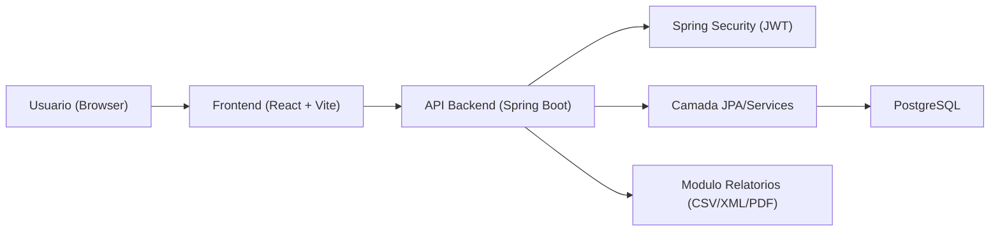
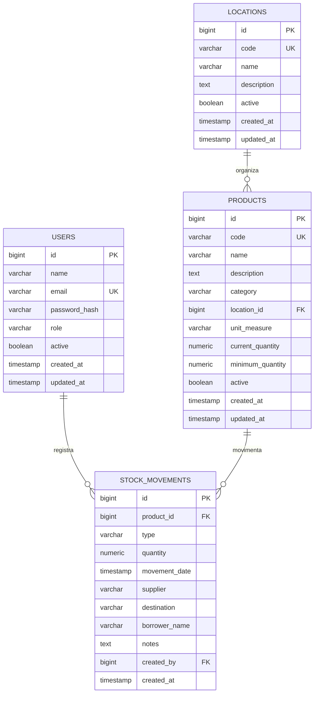
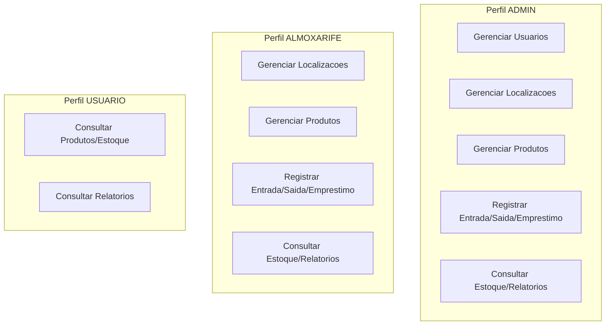
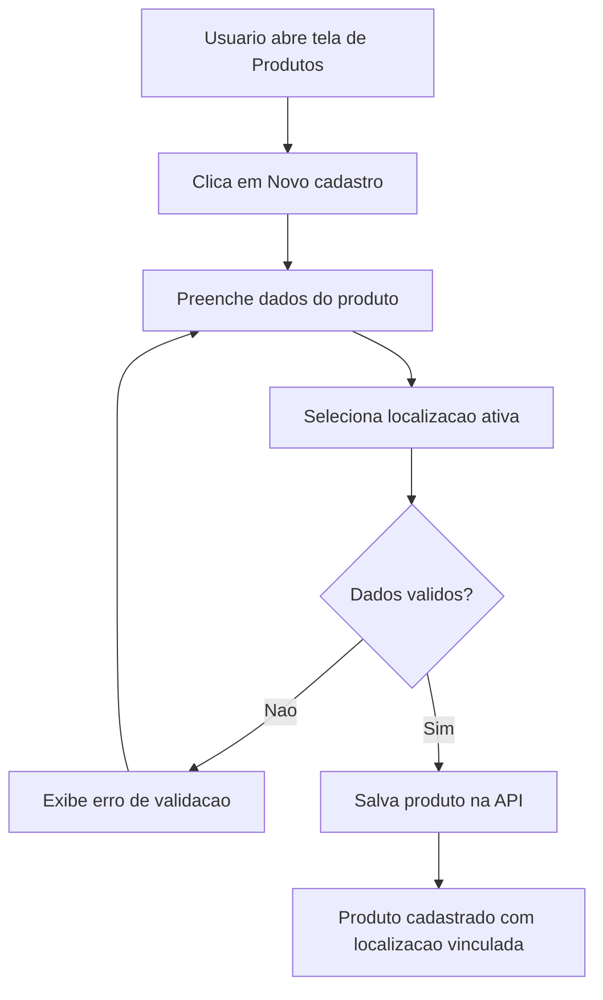
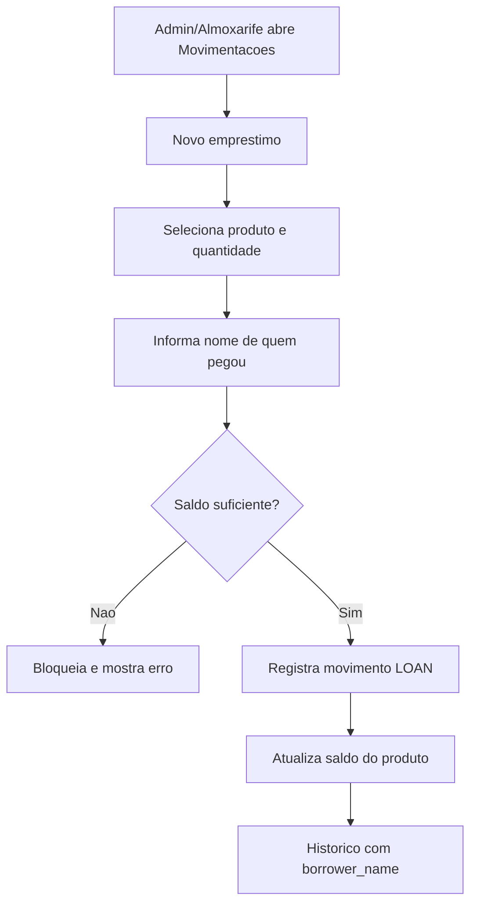
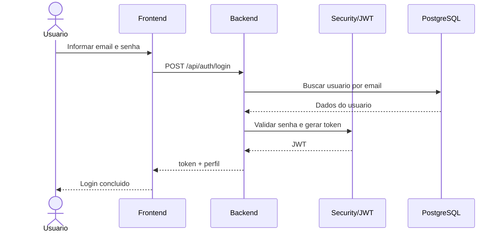
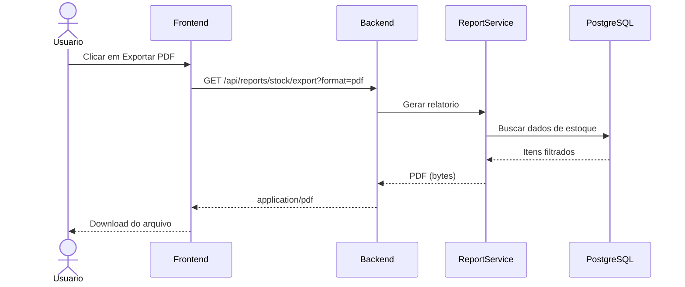

# DMS - Diagramas Mermaid (FullStock)

## 1. Arquitetura Geral

## 2. Modelo Entidade-Relacionamento (ER)

## 3. Casos de Uso por Perfil

## 4. Fluxo de Cadastro de Produto com Localizacao

## 5. Fluxo de Emprestimo

## 6. Sequencia - Login JWT

## 7. Sequencia - Exportacao de Relatorio PDF

