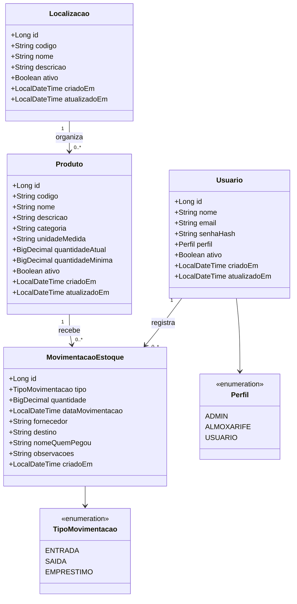
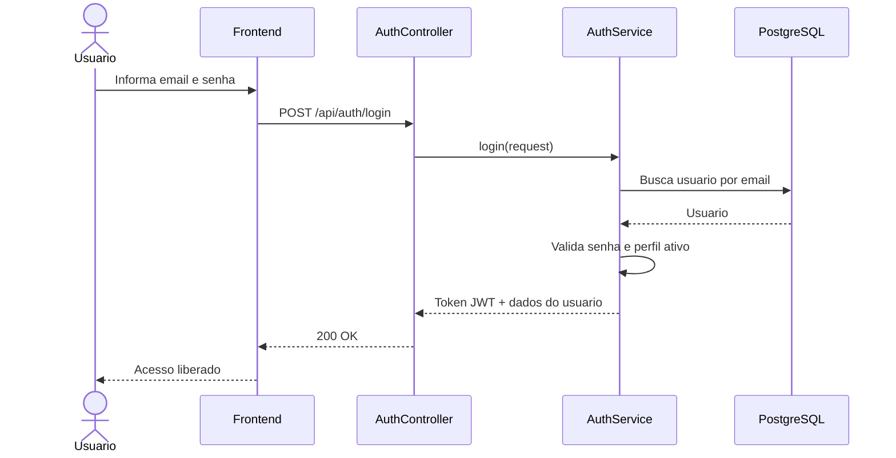
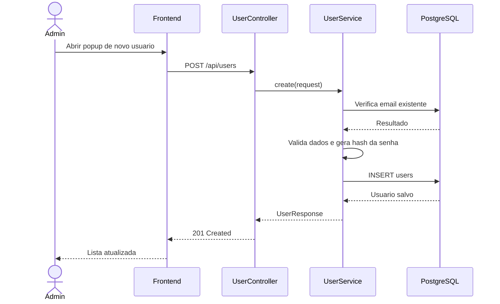
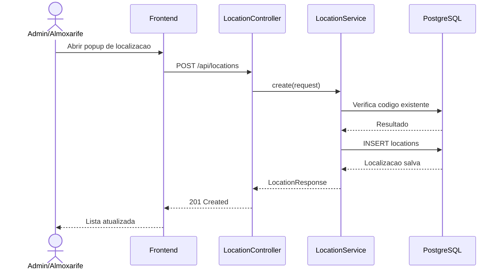
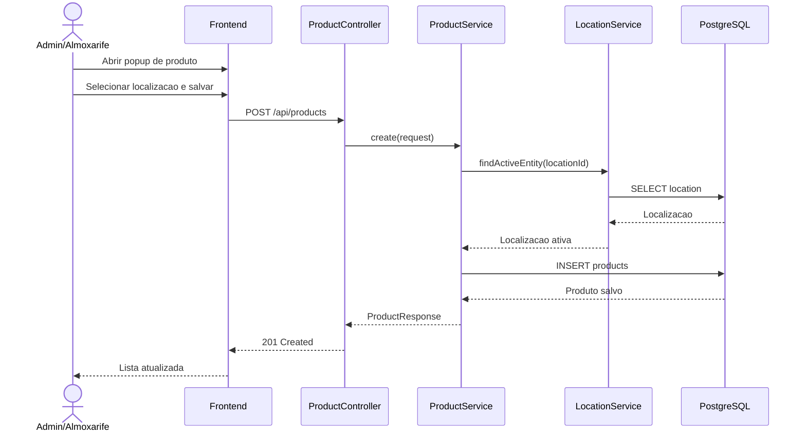
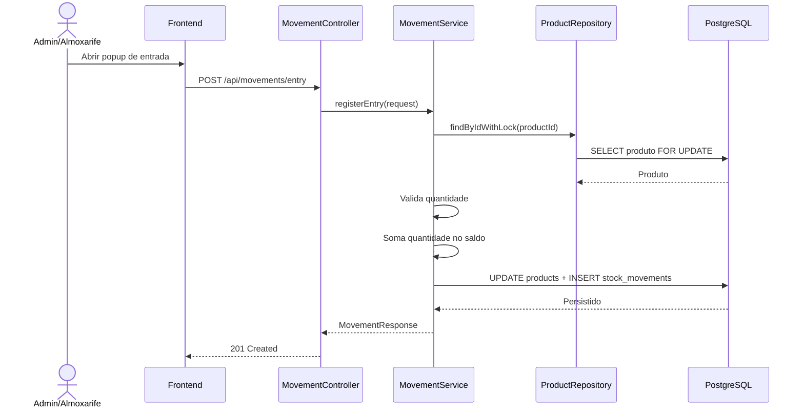
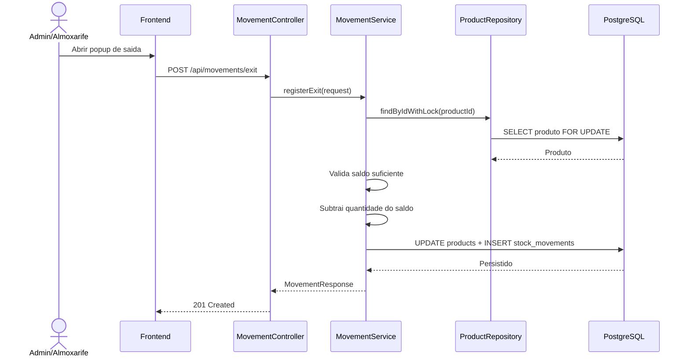
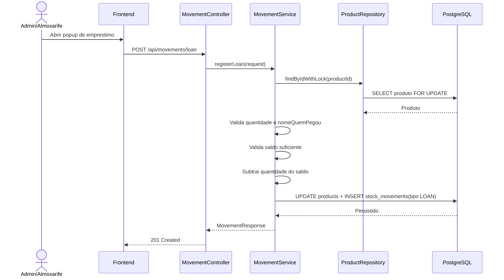
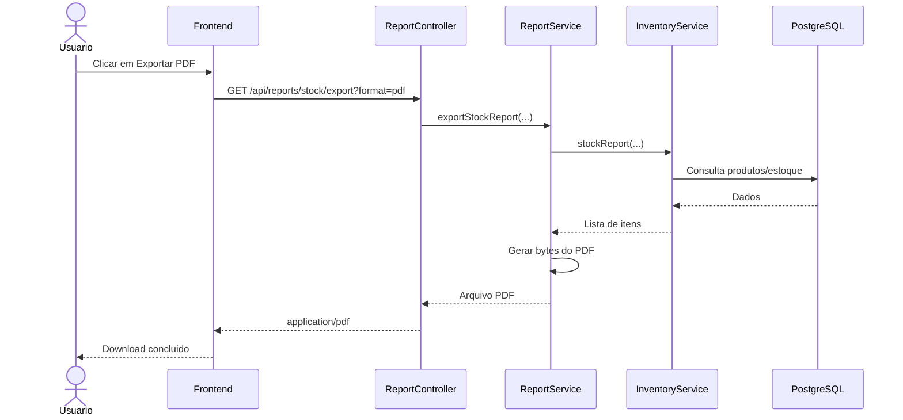
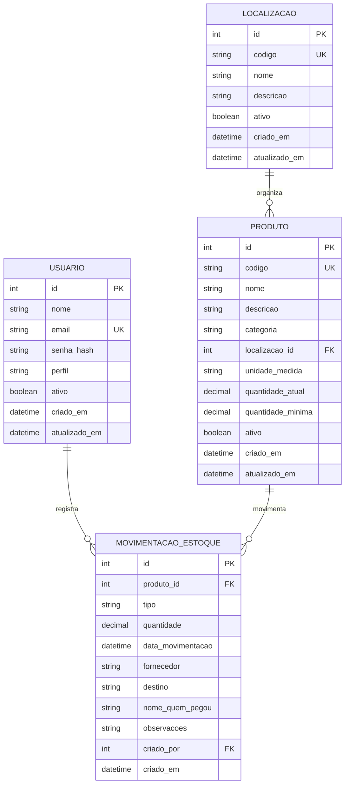

# DMS - Diagramas Obrigatorios (Mermaid)

## 1. Diagrama de Classe

## 2. Diagramas de Sequencia (Telas Principais)

### 2.1 Tela de Login

### 2.2 Tela de Usuarios (Cadastro/Edicao)

### 2.3 Tela de Localizacoes (Cadastro/Edicao)

### 2.4 Tela de Produtos (Vinculo com Localizacao)

### 2.5 Tela de Movimentacoes - Entrada

### 2.6 Tela de Movimentacoes - Saida

### 2.7 Tela de Movimentacoes - Emprestimo

### 2.8 Tela de Relatorios (Exportacao PDF)

## 3. Diagrama Entidade-Relacionamento (ER)

